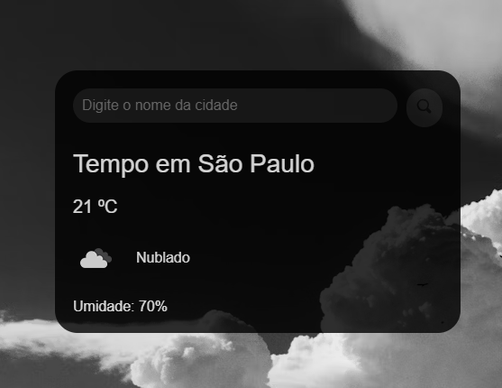

# ⛅ App de Previsão do Tempo

Este é um aplicativo simples e responsivo de **Previsão do Tempo**, criado com **HTML, CSS e JavaScript**, que consome uma API de clima em tempo real. Com ele, o usuário pode pesquisar qualquer cidade e visualizar as condições climáticas atuais de forma prática.

## 📸 Demonstração




## 🌦️ Funcionalidades

- Pesquisa de clima por nome da cidade.
- Exibe:
  - Temperatura atual
  - Sensação térmica
  - Umidade do ar
  - Condição do tempo (ensolarado, nublado, chuvoso etc.)
  - Ícone representativo do clima
- Exibição de mensagens de erro (ex: cidade não encontrada).
- Design responsivo e leve.

## 🚀 Tecnologias Utilizadas

- **HTML5** – estrutura do app
- **CSS3** – estilização moderna e responsiva
- **JavaScript** – lógica de busca e manipulação do DOM
- **API pública de clima** (https://openweathermap.org/api)

## 📦 Como usar

1. Clone o repositório:
   ```bash
   git clone https://github.com/RenatoAlmeidaDev/app-previsao-tempo.git

🧑‍💻 Autor:

Renato Almeida – https://github.com/RenatoAlmeidaDev